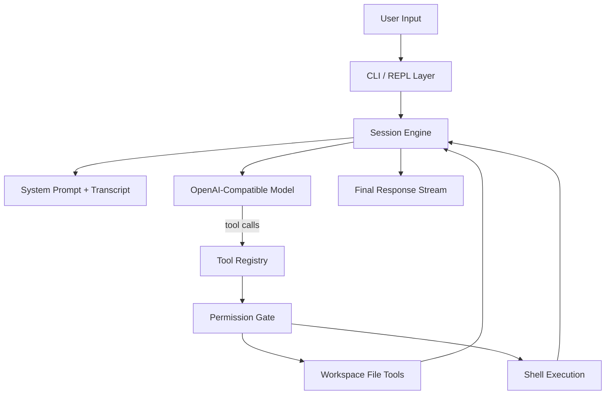

<p align="center">
  
</p>

<p align="center">
  <strong>A Python coding-agent CLI for local development.</strong>
  <br />
  <code>claudecode-py</code> combines an interactive REPL, a transcript-driven session engine, a typed tool runtime, and an explicit approval boundary into a compact Claude Code style command-line workflow.
</p>

<p align="center">
  
  
  
  
  
</p>

## Overview

`claudecode-py` is a local coding-agent harness built for practical development workflows. It provides:

- an interactive terminal interface
- a persistent session loop backed by an OpenAI-compatible model
- structured tool calling for file and shell operations
- explicit approval for mutating actions
- workspace-bounded execution for safer local automation

Instead of wrapping a model in a thin script, the project is organized as a small agent runtime. User requests are appended to a transcript, the model can invoke typed tools, tool results are fed back into the conversation state, and the loop continues until the agent returns a final response.

## Highlights

- Interactive REPL with slash commands for day-to-day terminal use
- Transcript-driven session engine with persistent conversation state
- Typed tool definitions that serialize to OpenAI-compatible tool schemas
- Built-in local development tools for listing files, reading files, editing files, and running shell commands
- Human approval for side-effectful actions before execution
- Workspace path guards to keep file operations scoped to the selected project root

## Architecture



The runtime is separated into four core layers:

- Entry layer: `claudecode chat` starts the REPL and handles slash commands
- Session layer: `SessionState` owns conversation history, model calls, and the agent loop
- Tool layer: each tool exposes a schema, description, mutability flag, and execution function through a shared contract
- Control layer: approval prompts, workspace path guards, and shell timeouts define the operational boundary

## Execution Model

At the center of the project is a transcript-driven agent loop:

1. The user submits a prompt in the REPL.
2. The session appends that message to the conversation state.
3. The model receives the transcript together with the registered tool schemas.
4. If the model emits tool calls, the runtime validates them, checks approvals when needed, executes the tools, and appends tool results back into the transcript.
5. The loop continues until the model returns a final natural-language response.

This keeps the control flow explicit while preserving the interaction pattern expected from a modern coding agent.

## Query Lifecycle

```text
user prompt
  -> session transcript
  -> model request with tool schemas
  -> tool call dispatch
  -> permission check
  -> tool execution
  -> tool_result appended
  -> next model turn
  -> final assistant response
```

The transcript acts as the model-visible working memory, and tool results become first-class context for subsequent turns.

## Tool Runtime

The tool system is defined around a single reusable contract:

```python
ToolSpec(
    name=...,
    description=...,
    input_schema=...,
    read_only=...,
    run=...,
)
```

That contract keeps the runtime consistent from both sides:

- model-facing: each tool can be serialized into an OpenAI-compatible schema
- runtime-facing: each tool has a predictable execution path and result shape
- control-facing: the system can distinguish read-only operations from mutating operations before execution

Current built-in tools:

- `list_files`
- `read_file`
- `write_file`
- `replace_in_file`
- `run_shell`

## Safety Model

The permission model is a core part of the runtime:

- Read-only tools execute directly.
- Mutating tools require explicit terminal confirmation.
- All file paths are resolved relative to the selected workspace root.
- Path traversal outside the workspace is rejected.
- Shell execution is non-interactive and timeout-bounded.

This gives the CLI a clear human-in-the-loop execution model: the agent can propose actions, while the host runtime remains the authority for state-changing operations.

## Project Layout

| Component | Responsibility |
| --- | --- |
| `src/claudecode/cli.py` | REPL entrypoint, slash commands, startup configuration |
| `src/claudecode/session.py` | Conversation state, model calls, tool-call loop, transcript updates |
| `src/claudecode/tools.py` | Workspace tools, shell runtime, path guards, tool registry |
| `src/claudecode/types.py` | Shared runtime types for tools, results, and execution context |
| `tests/` | CLI validation, tool behavior, permission flow, and agent-loop tests |

## Demo

<p align="center">
  
</p>

```text
$ claudecode chat --cwd .
claudecode-py
Workspace: /path/to/project
Model: gpt-4.1-mini
Type /help for commands.

you> summarize this repository
tool list_files
tool read_file
assistant> ...
```

## Installation

```bash
git clone https://github.com/sirichen2/claudecode-py.git
cd claudecode-py
python3 -m pip install -e .
```

## Configuration

Required environment variables:

- `OPENAI_API_KEY`

Optional environment variables:

- `OPENAI_BASE_URL`
- `OPENAI_MODEL`

## Usage

```bash
claudecode chat --cwd /path/to/project
```

You can also override the backend at launch time:

```bash
claudecode chat \
  --cwd /path/to/project \
  --model gpt-4.1-mini \
  --base-url https://api.openai.com/v1
```

## Slash Commands

- `/help`
- `/tools`
- `/reset`
- `/exit`

## Verification

```bash
cd claudecode-py
PYTHONPATH=src python3.11 -m pytest
```

Current local test status: `9 passed`.
